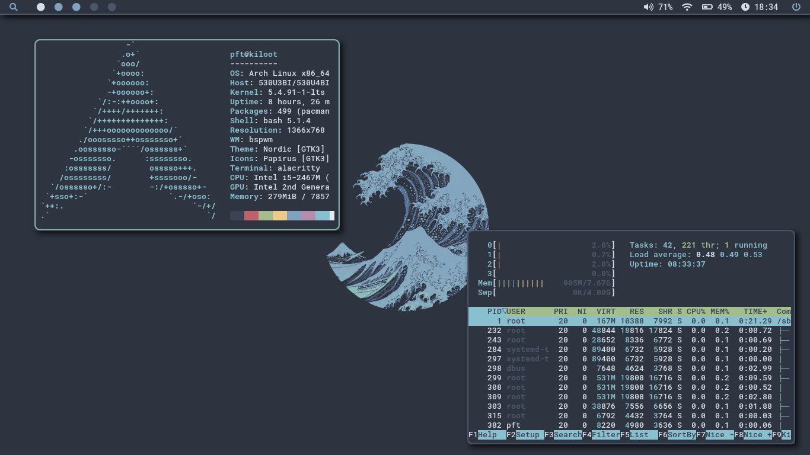

# Nord lovers
This is my personal collection of configuration files.
The [setup section](#install-these-dotfiles-and-all-dependencies) will
guide you through the installation process.



Here are some details about my setup:
* **Distro**: Arch linux
* **WM**: [Bspwm](https://github.com/baskerville/bspwm)
* **Terminal**: [Alacritty](https://github.com/alacritty/alacritty)
* **Shell**: bash
* **Editor**: [Emacs](https://www.gnu.org/software/emacs/)
* **File Manager**: Dired Emacs mode
* **Browser**: Firefox with [Minimal Functional Fox](https://github.com/mut-ex/minimal-functional-fox) & [startpage](https://github.com/deepjyoti30/startpage)
* **Launcher**: [Rofi](https://github.com/davatorium/rofi/)
* **Status bar**: [Polybar](https://github.com/polybar/polybar)
* **Image Viewer**: feh
* **General key binder**: [sxhkd](https://github.com/baskerville/sxhkd)
* **Music**: [mpd/mpc](https://www.musicpd.org/)
* **Music Player**: Spotify with [Dribblish](https://github.com/morpheusthewhite/spicetify-themes/tree/master/Dribbblish) theme
* **Compositor**: Jonaburg's fork of [Picom](https://github.com/jonaburg/picom)
* **Color Scheme**: [Nord](https://www.nordtheme.com/)
* **Fonts**: Roboto Mono Nerd Font for general text and Font Awesome 5
  free Solid for icons

## Install these dotfiles and all dependencies
Clone the repo files directly to your home directory and install the dependencies:

```
yay -S alacritty bspwm emacs fehg mpd mpc picom-jonaburg-git polybar
rofi spicetify-cli spotify sxhkd
```
